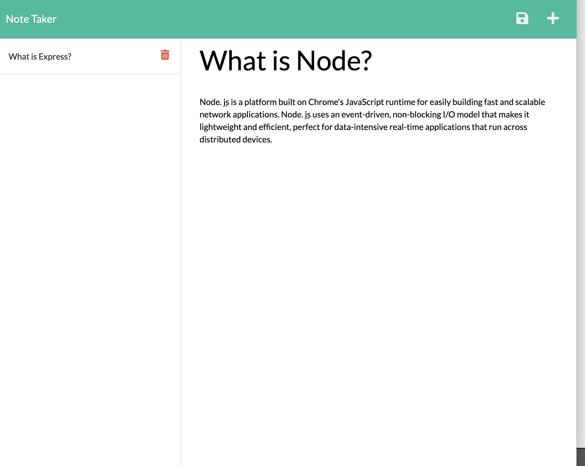

# notetaken

# 
  

## preview of the app 

## Table of Contents
* [Description](#Description) 
* [Motivation](#Motivation)
* [How to Use](#Usage)
* [Contributors](#Contributors) 
* [Tech Used](#Tech)
* [Dependencies](#dependencies)
* [Questions](#questions)
  
## [Description](#Description)  📝

This is a simple not taking app to help keep you organized. Easily add and delete notes that will be saved for as long as you need them. 
  
## [Motivation](#Motivation) 🤽‍♂️

Having trouble staying organized is something we can all relate too. Stay organized with this easy to use app! 
  
## [How to Use](#Usage) 

We used express routing technologies to create this app. It's deployed via Heroku and very simple to use in your web browser. 
  
## [Contributors](#Contributors)🏆
Jillian FitzMaurice 
  
## [Tech Used](#Tech)🎯
npm, node, express, 
  
## [Dependencies](#dependencies)
  npm i, 
## [Questions](#questions)📟
  Find me on Github! 
  
  or you can email me at info@jilliankayworks.com 
## License

Copyright: ApacheLicense2.0
[License link](https://www.apache.org/licenses/LICENSE-2.0)